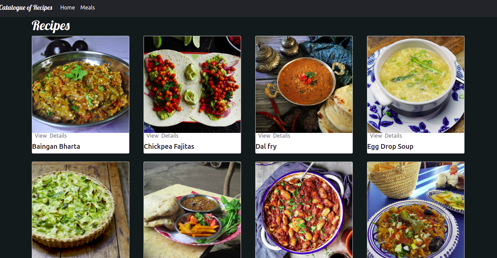

# Catalogue of Recipes


A    capstone project for React-Redux Module

A catalogue of recipes using built with react and redux. It dispalys a browsable list of items meals fetched from an API
[mealdb](https://www.themealdb.com/api.php)

The web app has 3 pages:
- One page with a list of categories available at the [mealdb](https://www.themealdb.com/api.php) API.These are browsable to display meals in each category.
- One page with meals filtered by category
- One page with details about the specific meal

## Meals filtered by category

## Specific Meal Details


## Built With

- JavaScript
- React
- Redux
- Bootstrap
- CSS
## [Live Link](https://catalogue-of-recipess.herokuapp.com/)


# Getting Started 
To get started clone this repo
```
https://github.com/Byabasaija/Catalogue_of_recipes.git
```
Go to the project directory
```
npm install
npm start
```


This project was bootstrapped with [Create React App](https://github.com/facebook/create-react-app).

## Available Scripts

In the project directory, you can run:

### `npm start`

Runs the app in the development mode.\
Open [http://localhost:3000](http://localhost:3000) to view it in the browser.

The page will reload if you make edits.\
You will also see any lint errors in the console.

### `npm test`

Launches the test runner in the interactive watch mode.\
See the section about [running tests](https://facebook.github.io/create-react-app/docs/running-tests) for more information.

### `npm build`

Builds the app for production to the `build` folder.\
It correctly bundles React in production mode and optimizes the build for the best performance.

The build is minified and the filenames include the hashes.\
Your app is ready to be deployed!

See the section about [deployment](https://facebook.github.io/create-react-app/docs/deployment) for more information.

### `npm eject`

**Note: this is a one-way operation. Once you `eject`, you can’t go back!**

If you aren’t satisfied with the build tool and configuration choices, you can `eject` at any time. This command will remove the single build dependency from your project.

Instead, it will copy all the configuration files and the transitive dependencies (webpack, Babel, ESLint, etc) right into your project so you have full control over them. All of the commands except `eject` will still work, but they will point to the copied scripts so you can tweak them. At this point you’re on your own.

You don’t have to ever use `eject`. The curated feature set is suitable for small and middle deployments, and you shouldn’t feel obligated to use this feature. However we understand that this tool wouldn’t be useful if you couldn’t customize it when you are ready for it.

## Author

👤 **Pascal Byabasaija**

**Github** [Byabasaija](https://github.com/Byabasaija)

**Linkedin** [Pascal Byabasaija](https://linkedin/in/pascal-byabasaija)

**Twitter** [Pascal](https://twitter.com/byabashaijapoet)

## Acknowledgements
[mealdb](https://www.themealdb.com/api.php)

## 🤝 Contributing

Contributions, issues, and feature requests are welcome!


## Show your support

Give a ⭐️ if you like this project!

## 📝 License

MIT
